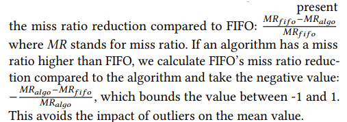

# Deisgn a New Cache Replacement Policy
## Prerequisites
### Install Python Packages
Install `matplotlib`, `colorlog` and `numpy`. For example, if you use anaconda:
```bash
conda install conda-forge::colorlog
conda isntall conda-forge::numpy
conda install conda-forge::matplotlib
```
### Install libCacheSim
[libCacheSim](https://github.com/1a1a11a/libCacheSim) is high-performance caceh simulator.
1. Install dependency
    - Install glib, tcmalloc and cmake

        ```bash
        sudo apt install libglib2.0-dev libgoogle-perftools-dev cmake
        ```

    - Isntall zstd


        ```bash
        wget https://github.com/facebook/zstd/releases/download/v1.5.0/zstd-1.5.0.tar.gz
        tar xvf zstd-1.5.0.tar.gz
        pushd zstd-1.5.0/build/cmake/
        mkdir _build && cd _build/
        cmake .. && make -j
        sudo make install
        popd
        ```
    
    For more details, refer to https://github.com/1a1a11a/libCacheSim/blob/develop/doc/install.md.

2. Clone & build libCacheSim

    ```bash
    git clone https://github.com/1a1a11a/libCacheSim
    pushd libCacheSim
    mkdir _build && cd _build
    cmake .. && make -j
    [sudo] make install
    popd
    ```

    For more details, refer to https://github.com/1a1a11a/libCacheSim?tab=readme-ov-file

3. In [utils.py](./utils.py), set `LIBCACHSIM_PATH` as the absoluate path to `libCacheSim/` on your local machine.

### Install OpenBox
[OpenBox](https://github.com/PKU-DAIR/open-box) is a generalized blackbox optimization  system. 

**Install requirements: python >= 3.8 (3.8 is recommended)**

```bash
pip install --upgrade pip setuptools wheel
pip install openbox
```

For more details, refer to https://github.com/PKU-DAIR/open-box. 


## Design & test your cache replacement policy
Your goal is to design a new cache replacement policy. We wish the policy to have lower miss ratio compared to the SOTAs (lfu, random, lru, slru, arc, clock, sieve, s3fifo, tinyLFU). 

[214.py](./cache/sample_code/214.py) may help you design. It is a new policy with lower miss ratio, but it has a high time and space complexity (generally, the space complexity consumed by the metadata in a cache replacement policy should be at most linear to the cache size). You may think of how to lower its memory consumption and time cost without harming its miss ratio. For example, using priority queue can reduce the time cost, as implemented in [214-pq.py](./cache/sample_code/214-pq.py), but this doesn't solve the problem of high space complexity.

To write the code, follow the instruction in [code_design_prompt.txt](./code_design_prompt.txt). You can refer to [fifo.py](./cache/sample_code/fifo.py), [lru.py](./cache/sample_code/lru.py), [lfu.py](./cache/sample_code/lfu.py), [214.py](./cache/sample_code/214.py), and [214-pq.py]([fifo.py](./cache/sample_code/214-pq.py)) as examples.

1. [Design] Come up with a cache replacement policy. 
2. [Design] Implement the required functions following the instructions, and save the python code file under [cache/sample_code](./cache/sample_code/) using a brand-new file name.
3. [Test] Add the absolute path of your code to `self_designed_algo_list` in line 41 of  [test.py](./test.py), and then run

    ```bash
    python test.py
    ```
    
    The result will be recorded in [miss_ratio.jsonl](./analysis/miss_ratio.jsonl), and [miss_ratio_percentile.png](./analysis/miss_ratio_percentile.png) is its visualiztion. The miss ratio (tuned) is calculated as a reduction w.r.t. FIFO's miss ratio:

    

    (cited from [s3fifo paper](https://dl.acm.org/doi/pdf/10.1145/3600006.3613147) page 8 first paragraph.)

    Currently [miss_ratio.jsonl](./analysis/miss_ratio.jsonl) is empty. If you want to reproduce the current [miss_ratio_percentile.png](./analysis/miss_ratio_percentile.png) before designing your own policy, simply run [test.py](./test.py). 

    If you want to visualize the result using default miss ratios, simply set `use_default` as True (line 35 in [test.py](./test.py)).

    > **Note: Tuned vs. Default miss ratios**
    >
    > Many policies have user-defined parameters. For example, user can choose the window size and the main cache type for [tinyLFU](https://github.com/1a1a11a/libCacheSim/blob/develop/libCacheSim/cache/eviction/WTinyLFU.c) in libCacheSim. [214.py](./cache/sample_code/214.py) also have tunable parameter `LEARNING_RATE`.
    > 
    > We find that by tuning such parameters, there is a performance boost (i.e., a drop in miss ratio). 
    > 
    > Tuned miss ratio is the minimum miss ratio after tuning such parameters for several (20) runs.
    >
    > Default miss ratio is the miss ratio using the default parameters, without any tuning. 

## More info
You may skip this section. 
### Run a policy on a trace using [SimulatorCache](./Simulator.py)

See [example_simulatorcache.py](./example_simulatorcache.py).
- `simulate()`: Simulate the policy [214.py](./cache/sample_code/214.py) on the trace [0.oracleGeneral.bin](./cache/trace/zipf/alpha1_m100_n1000/0.oracleGeneral.bin). The output `mr` is the miss ratio. The simulation time cost is also shown in the output.
- `tune()`: Tune the parameter(s) in [214.py](./cache/sample_code/214.py) (line 7, `LEARNING_RATE`) to minimze the miss ratio. The `tuned_mr`, `default_params` and `tuned_params` in the output are the minimum miss ratio after tuning, the default parameter(s) before tuning, and the tuned parameters that achieve(s) the minimum miss ratio, respectively.
    - `default_params`: if you set `fixed_default_param`(line 79) as 
        - False: the `default_params` will be the one in your code (e.g., 0.1 in [214.py](./cache/sample_code/214.py)).
        - True: the `default_params` will be set according to the following rules (line 294-318 in [Simulator.py](./Simulator.py)):
            - if a parameter is of type `int`: default it as 3
            - if a paremeter is of type `float`: default it as 0.42
            - if a parameter is of type `bool`: default it as `True`

### Run an existing policy on a trace using libCacheSim

See [example_libcachesim.py](./example_libcachesim.py). You can use this to run existing SOTA cache replacement policies, listed in https://github.com/1a1a11a/libCacheSim?tab=readme-ov-file#eviction-algorithms. 

For tuning the parameters of SOTA policy (`tune_libcahesim()`), currently, we only support the following policies:
```
twoq, slru, RandomLRU, tinyLFU, fifomerge, sfifo, sfifov0, lru-prob, s3lru, s3fifo, s3fifod, lecar.
```
(as listed in line 99-151 in [utils.py](./utils.py).)

### Setting Configs


#### Timeout limit
The cache simulator has a timeout limit set as 5 seconds. For our cases ([alpha1_m100_n1000](./cache/trace/zipf/alpha1_m100_n1000/)), 5s is enough to simulate a replacement policy on one trace. If it exceeds this limit, with high probability there is an infinite loop in the replacement policy. If you want to change this limit, go to [Simulator.py](./Simulator.py) and change `SimulatorBase.timeout_limit` (line 61). 

#### Tune runs
You can set the number of runs to tune the parameters in a cache replacement policy by setting `tune_runs` in `SimulatorConfig`(line 45 in [Simulator.py](./Simulator.py)).

For example, if you want to tune 20 runs: see line 64 in [example_simulatorcache.py](./example_simulatorcache.py).

The default number of tune runs is 20. **Please don't change it when you are testing your design.**